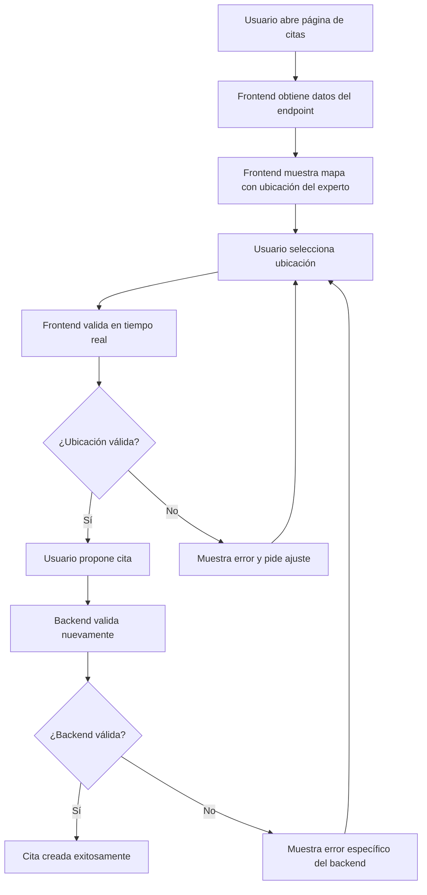

# 📋 Ejemplo de Respuesta Actualizada - Endpoint details-complete

## ✅ **Problema Resuelto**

Ahora el endpoint `GET /api/Search/{searchId}/details-complete` incluye la información de ubicación del experto **incluso cuando no hay cita creada**, permitiendo al frontend validar ubicaciones antes de proponer citas.

## 🎯 **Nueva Estructura de Respuesta**

### **Cuando NO hay cita (`"appointment": null`)**

```json
{
  "search": {
    "id": 209,
    "userId": 28,
    "title": "revisión presencial",
    "description": "https://es.wallapop.com/item/honda-cbr600rr-2004-circuito-1180717747",
    "frequency": 6,
    "isActive": true,
    "isRevised": true,
    "lastExecution": "0001-01-01T00:00:00",
    "nextExecution": "0001-01-01T00:00:00",
    "createdAt": "2025-10-14T19:41:01.878118Z",
    "startDate": "0001-01-01T00:00:00",
    "locationName": null,
    "category": 0,
    "user": {
      "id": 28,
      "email": "patatanocaliente1@gmail.com",
      "name": "patata nocaliente",
      "profilePictureUrl": null
    },
    "searchHire": {
      "id": 81,
      "expertId": null,
      "status": "pending",
      "statusTranslated": "",
      "createdAt": "2025-10-14T19:41:02.544845Z",
      "expert": {
        "id": 34,
        "email": "a26865@svalero.com",
        "name": "Diego Castilla Abella",
        "profilePictureUrl": null
      },
      "service": {
        "id": 122,
        "serviceTypeId": 1,
        "serviceTypeName": "Revisión presencial",
        "serviceTypeCategoryId": 2,
        "serviceTypeCategoryName": "Revisión",
        "requiresAppointment": false,
        "price": 2133,
        
        // ✅ NUEVOS CAMPOS: Información de ubicación del experto
        "expertLatitude": 40.4168,   // Ubicación del experto (Madrid)
        "expertLongitude": -3.7038,  // Ubicación del experto (Madrid)
        "locationRange": 50          // Rango máximo: 50km
      }
    },
    "unreadMessagesCount": 0,
    "hasPendingAppointment": false,
    "pendingAppointmentStatus": null
  },
  "moneyDistribution": null,
  "category": {
    "id": 2,
    "name": "Revisión",
    "parentId": null,
    "isActive": true,
    "createdAt": "2025-09-17T18:20:29.938225Z",
    "updatedAt": "2025-09-17T18:20:29.938225Z"
  },
  "review": null,
  "appointment": null,  // ← No hay cita, pero ahora tenemos la info del experto
  "deliverables": [],
  "disputes": []
}
```

### **Cuando SÍ hay cita**

```json
{
  "search": {
    // ... datos de búsqueda ...
    "searchHire": {
      // ... datos del contrato ...
      "service": {
        "id": 123,
        "serviceTypeId": 1,
        "serviceTypeName": "Revisión presencial",
        "serviceTypeCategoryId": 2,
        "serviceTypeCategoryName": "Revisión",
        "requiresAppointment": false,
        "price": 213,
        
        // ✅ NUEVOS CAMPOS: Información de ubicación del experto
        "expertLatitude": 40.4168,   // Ubicación del experto (Madrid)
        "expertLongitude": -3.7038,  // Ubicación del experto (Madrid)
        "locationRange": 50          // Rango máximo: 50km
      }
    }
  },
  "appointment": {
    "id": 12,
    "searchHireId": 82,
    "status": "awaiting_appointment",
    "proposedDate": "0001-01-01T00:00:00",
    "proposedTime": "00:00:00",
    "location": "",
    "latitude": null,           // Ubicación propuesta para la cita (aún no definida)
    "longitude": null,          // Ubicación propuesta para la cita (aún no definida)
    
    // ✅ NUEVOS CAMPOS: Información de ubicación del experto (duplicada para conveniencia)
    "expertLatitude": 40.4168,  // Ubicación del experto (Madrid)
    "expertLongitude": -3.7038, // Ubicación del experto (Madrid)
    "locationRange": 50,        // Rango máximo: 50km
    
    "doorNumber": null,
    "ownerPhone": null,
    "siteDetails": null,
    "clientName": "patata nocaliente",
    "expertName": "Diego Castilla Abella",
    "amount": 213,
    "timers": []
  }
}
```

## 🔧 **Implementación Frontend**

### **Acceso a la Información**

```typescript
// Obtener datos del endpoint
const { data: searchDetails } = useSearchDetailsComplete(searchId);

// Acceder a la información de ubicación del experto
const expertLocation = searchDetails?.search?.searchHire?.service;
const appointmentData = searchDetails?.appointment;

// Información disponible en ambos casos:
const expertLatitude = expertLocation?.expertLatitude;
const expertLongitude = expertLocation?.expertLongitude;
const locationRange = expertLocation?.locationRange || 50;

// Si hay cita, también está disponible en appointment:
const appointmentExpertLat = appointmentData?.expertLatitude;
const appointmentExpertLon = appointmentData?.expertLongitude;
const appointmentRange = appointmentData?.locationRange;
```

### **Validación en Tiempo Real**

```typescript
// Función para validar ubicación antes de crear/proponer cita
function validateLocationBeforeAppointment(
  selectedLat: number,
  selectedLon: number,
  searchDetails: SearchDetailsCompleteResponseDto
): { isValid: boolean; message?: string; distance?: number } {
  
  const service = searchDetails.search.searchHire?.service;
  if (!service?.expertLatitude || !service?.expertLongitude) {
    return { isValid: false, message: "No se pudo obtener la ubicación del experto" };
  }
  
  const distance = calculateDistance(
    service.expertLatitude,
    service.expertLongitude,
    selectedLat,
    selectedLon
  );
  
  const maxRange = service.locationRange || 50;
  
  if (distance > maxRange) {
    return {
      isValid: false,
      message: `La ubicación está fuera del rango del experto. Distancia: ${distance.toFixed(1)} km, Rango máximo: ${maxRange} km`,
      distance
    };
  }
  
  return { isValid: true, distance };
}
```

## 🎯 **Beneficios de la Implementación**

### ✅ **Para el Frontend**
- **Información siempre disponible**: No importa si hay cita o no
- **Validación previa**: Puede validar antes de enviar al backend
- **Mejor UX**: El usuario ve inmediatamente si la ubicación es válida
- **Consistencia**: La información está en un lugar lógico (`service`)

### ✅ **Para el Backend**
- **Validación doble**: Frontend + Backend
- **Mensajes específicos**: Errores claros y detallados
- **Integridad**: Se mantiene la ubicación original del experto

### ✅ **Para el Usuario**
- **Feedback inmediato**: Ve si la ubicación es válida al seleccionarla
- **Información clara**: Sabe exactamente por qué no puede proponer una cita
- **Transparencia**: Ve el rango del experto y su ubicación

## 📍 **Casos de Uso**

### **Caso 1: Usuario selecciona ubicación válida**
1. Frontend valida en tiempo real ✅
2. Usuario propone cita
3. Backend valida nuevamente ✅
4. Cita creada exitosamente

### **Caso 2: Usuario selecciona ubicación inválida**
1. Frontend valida en tiempo real ❌
2. Muestra mensaje de error inmediatamente
3. Usuario ajusta ubicación
4. Proceso continúa normalmente

### **Caso 3: Experto cambia ubicación después de ser contratado**
1. Frontend usa ubicación original (del `service`) ✅
2. Backend valida contra ubicación original ✅
3. Sistema mantiene integridad del contrato ✅

## 🔄 **Flujo Completo**



¡Ahora el sistema está completo y el frontend tiene toda la información necesaria para una excelente experiencia de usuario!


